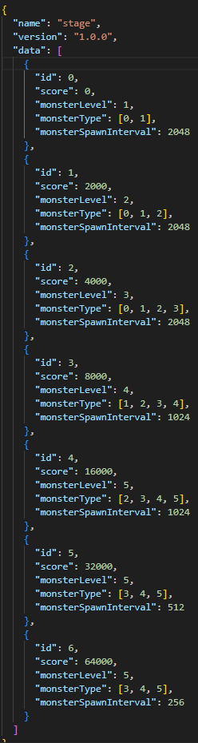
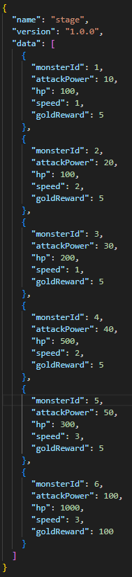

# tower-defense-game

### 게임 설명

회원가입/ 로그인후 게임을 시작한다.

몰려오는 몬스터를 타워를 배치하여서 막는 게임이다.

초기 골드를 사용 하여 타워를 랜덤으로 배치한다.

타워의 위치가 별로일 경우 환불하여 골드를 돌려 받는다.

점수를 기준으로 스테이지가 넘어가며, 출몰하는 몬스터의 종류 또한 달라진다.

낮은 확률로 황금고블린이 등장하며, 대량을 골드를 획득 할 수가 있다.

업그레이드를 통하여 포탑의 공격력, 공격 주기, 범위가 증가한다.

몬스터가 기지에 도달하면 체력이 감소하며 hp가 0이되면 게임 오버가 된다.

### AWS 배포 링크

- [tower-defense-game](13.209.10.190:3000)

### 기능

- 회원가입/로그인

  - 회원가입 페이지에서 Id와 비밀번호 입력
  - 데이터 베이스에 고유 uuid와 최고 점수 0점 저장 됨
  - 로그인 시 고유 uuid 쿠키 생성

- 타워 구입 기능

  - 타워 구매시 골드 차감
  - 이후 몬스터 이동 경로 근처에 랜덤으로 생성
  - 최대 20개 까지 배치 가능

- 몬스터 처치 기능

  - 타워로 몬스터 공격후 hp가 0이하시 처치
  - 처치 후 골드와 몬스터 종류 별 점수 획득

- 타워 환불 기능

  - 타워 환불시 골드 추가
  - 최근에 만든 타워 환불 됨
  - 타워 업그레이드 수치 만큼 골드 금액 환불

- 타워 업그레이드 기능

  - 업그레이드 할 타워 마우스로 지정 후 업그레이드 창 활성화
  - 타워 업그레이드시 골드 차감
  - 업레이드시 타워 위에 별 추가, 공격력, 공격 주기, 공격 범위 증가

- 보물 고블린 출현 기능

  - 모든 스테이지에서 10% 확률로 황금 고블린이 등장
  - 황금 고블린을 처치하면 대량의 골드 획득

- 최고 기록 갱신 기능
  - redis를 이용해서 현재 점수가 최고 점수 보다 높을 경우 갱신

### 패킷 구조


### 데이터 테이블

스테이지 데이터 테이블



몬스터 데이터 테이블



### Skills


### 폴더 구조

```markdown
assets/
├── monster.json
└── stage.josn

client/
├── images/
│├── base.png
│├── bg.webp
│├── favicon.ico
│├── monstre1.png
│├── monstre2.png
│├── monstre3.png
│├── monstre4.png
│├── monstre5.png
│├── monstre6.png
│├── path.png
│├── tower1.png
│├── tower2.png
│├── tower3.png
│├── tower4.png
│├── tower5.png
│└── tower6.png
├── src/
│├── base.js
│├── Constants.js
│├── game.js
│├── login.js
│├── monster.js
│├── register.js
│└── tower.js
├── index.html
├── login.html
└── register.html
node_modules/

readmeAssets/
├── monster.png
├── packet.png
└── stage.png

src/
├── handler.js/
│ ├── base.handler.js
│ ├── game.handler.js
│ ├── handlerMapping.js
│ ├── helper.js
│ ├── index.handler.js
│ ├── login.handler.js
│ ├── monster.handler.js
│ ├── register.handler.js
│ ├── tower.handler.js
│ └── userData.handler.js
├── inint/
│ ├── assets.js
│ └── socket.js
├── models/
│ ├── stage.model.js
│ ├── tower.model.js
│ └── user.model.js
├── utils/
│ ├── app.js
│ └── constants.js
└──

.env
.gitignore
.prettierrc
package.json
README.md
yarn.lock
```
